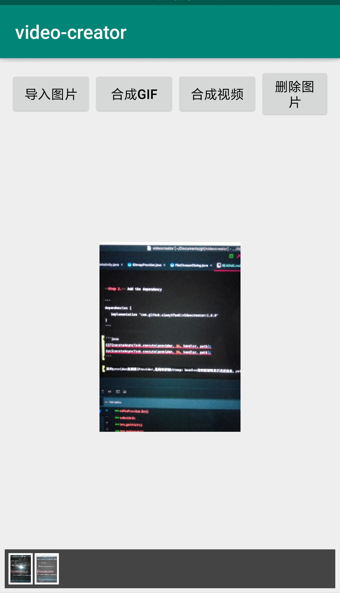

# video-creator

android 纯java实现图片合成视频

### 用法

**Step 1.** Add it in your root build.gradle at the end of repositories:

```
allprojects {
    repositories {
        ...
        maven { url 'https://jitpack.io' }
    }
}
```


**Step 2.** Add the dependency

```
dependencies {
   implementation 'com.github.xiaoyifan6:videocreator:1.0.1'
}
```

```java
GIFExecuteAsyncTask.execute(provider, 16, handler, path);
AvcExecuteAsyncTask.execute(provider, 16, handler, path);
```

其中provider是实现IProvider,是用来获取bitmap；handler用来获取和显示进度信息。path是需要保存的文件路径，包括文件名称

参考项目例子



### 文档

[Android MediaCodec图片合成视频](https://www.jianshu.com/p/54a702be01e1)

### 规范

[git 提交规则](https://open.leancloud.cn/git-commit-message/)

[Android 代码规范](https://github.com/Blankj/AndroidStandardDevelop)

[jitpack制作android库文档](https://jitpack.io/docs/ANDROID/)

